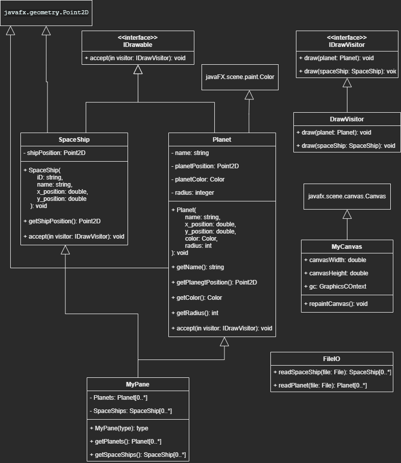

# UJ CSC2A Practical 6

## Table of Content

## Additional information

This has some similarities with the last practical, but this time, we were only dealing with Planets & SpaceShips. 
I think this practical had 2 main objectives:
- Use the Visitor Design Pattern.
- Work with the canvas & Graphics Context.

This time around, our lecturer is Mr. D Ogwok.

## UML

Admittedly, I didn't spend a lot of time working on the UML, I enjoyed the long holiday too much lol :). But enough jokes,
I actually struggle with the inheritance, This time we were inheriting from classes in the javafx library. I just improvised
& thought of a quick solution on the spot, I am not sure if this is the correct way to design the UML

## Visitor Design Pattern & Interfaces

**NB: I am still a student, I still have a limited understanding of design patterns, so my explanation could be bad.**

The Visitor design pattern is a behavioral design pattern with the following definition - "Represent an operation to be
performed on elements of an object structure. Visitor lets you define a new operation without changing the classes of
the elements on which it operates" - GO4

This is how I view the visitor design pattern. There are 2 types of objects, the:
- Visitor
- Visitable

The visitable has a method that accepts the Visitor. It's the Visitor's job to properly identify who it is visiting, & 
perform the appropriate actions based on who it is visiting. 

I'm still having a hard time wrapping my mind around it all. On one hand, I thought a abstract base class could have a 
`draw` method, but the SpaceShip & the Planet don't inherit from any parent class.

Another valid solution would be to create a IDrawbable interface, where the SpaceShip & Planet implements the inteface & 
implements how they wou;d be drawn. But I think the visitor design pattern achieves this.

The visitor design pattern allows us to seperate the drawing functionality seperately from the actual objects themselves.
With the 2 previous solutions, we'd have no choice but to implement the drawing functionality in the classes themselve,
whereas, using the visitor design pattern allows us to implement the functionality in a seperate class. We'll see how this
is achieve in a minute.

In this practical, there are 2 types of objects that will be drawn on the canvas, the [SpaceShip](./src/acsse/csc2a/model/SpaceShip.java)
& the [Planet](./src/acsse/csc2a/model/Planet.java)

**NB: going through the UML Class diagram & the actual interfaces & classes will give us a better idea.**

### Interfaces & Classes

First, we need to make the Visitor interface, which we'll call [IDrawVisitor](./src/acsse/csc2a/gui/IDrawVisitor.java).
The [IDrawVisitor](./src/acsse/csc2a/gui/IDrawVisitor.java) will have method signatures that implement will implement all
classes  that need implementation.

Visitables interface, which will be the [IDrawable](./src/acsse/csc2a/gui/IDrawable.java) 
interface. The interface has a method signature `accept`, the accept methods accepts a [visitor](./src/acsse/csc2a/gui/IDrawVisitor.java). 

